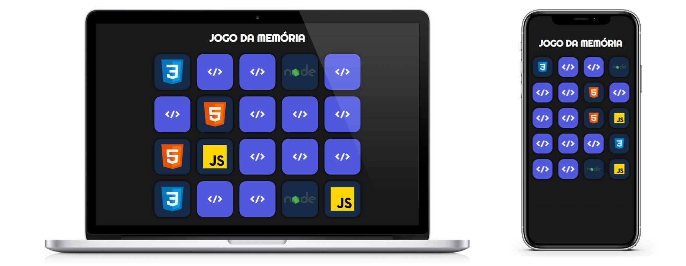

<h1 align="center">
  Jogo da memória
</h1>

   

  <a href="linkedin.com/in/wesley-emanuel-alves-de-oliveira-7b05781b9">Linkedin</a>&nbsp;&nbsp;&nbsp;|&nbsp;&nbsp;&nbsp;
  <a>Email: dev.wesleyalves@gmail.com</a>

## :clipboard: Sobre o Projeto

- Visual responsivo, com CSS;
- Toda a lógica do jogo feita com JavaScript, utilizando estruturas condicionais, callbacks, arrow functions, entre outras práticas;

## :computer: Tecnologias utilizadas

O projeto foi desenvolvido utilizando as seguintes tecnologias:

- JavaScript
- HTML
- CSS
